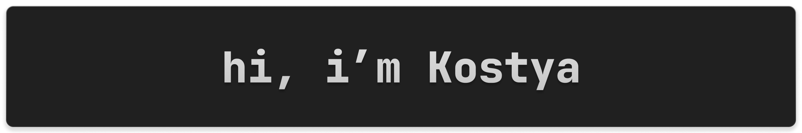

    

- I'm a high school student who love open-source, Linux and related stuff, developing software and learning computer science.
- I develop programs in C#, Python and Rust.
- My main OS is ArchLinux with a KDE Plasma.
- Usually Linux-based systems become the target platform for my programs.
- Fell in love with pastel color schemes.
- Currently working on [Pipe](https://github.com/kostya-zero/pipe) and [zeroProbe](https://github.com/kostya-zero/zeroProbe).

## :computer: What do I use?

