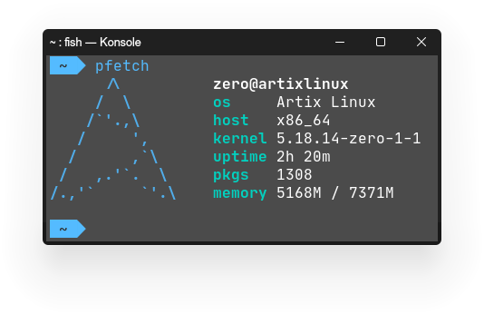

    <h1>Konstantin ".ZERO" Zhigaylo</h1>    

    <h2>Who am I?</h2>

- :wave: I'am a 16 years old back-end developer.
- :houses: Living in Russia, Orechovo-Zuevo.
- :computer:Works with C# and Python languages.
- :revolving_hearts: Loves his hobby.
- :briefcase: Currently working on [zeroProbe](https://gitlab.com/kostya-zero/zeroprobe) project.
- :open_file_folder: Would like to learn more about C#.
- :date: Started carier in 2017.
- :technologist: Prefer to work alone.

    <h2>My workspace</h2>

- **Operating System** - ArtixLinux.
- **Kernel** - 5.18.14 (self compiled)
- **Init system** - OpenRC.
- **Desktop Environment** - KDE Plasma.
- **Shell** - fish.
- **IDE and editors** - Neovim, JetBrains Rider, JetBrains PyCharm.
- **SDK's** - PyPy, dotnet.
- **Git Services** - GitLab (Main), GitHub.
- **Prefer font** - JetBrains Mono.
- **Dot Files** - https://gitlab.com/kostya-zero/dotfiles

    <h2>Socials w/ contacts</h2>

- **Mastodon** - https://mastodon.ml/@kostya_zer0
- **VK** - https://vk.com/kostya_zer0
- **Reddit** - https://www.reddit.com/user/zer0_on3
- **GitHub** - https://github.com/kostya-zero
- **GitLab** - https://gitlab.com/kostya-zero
- **Telegram** - @kostya_zer0